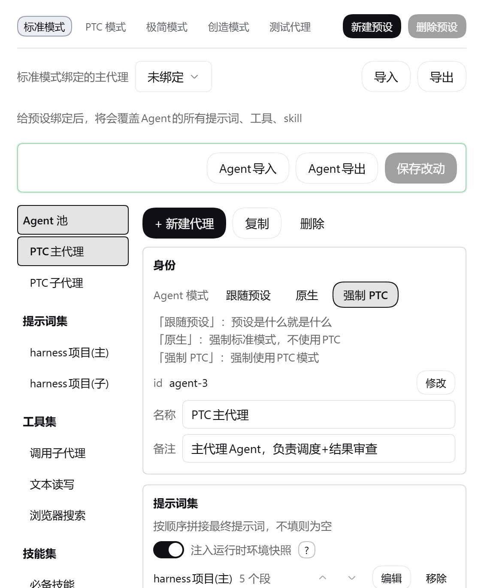
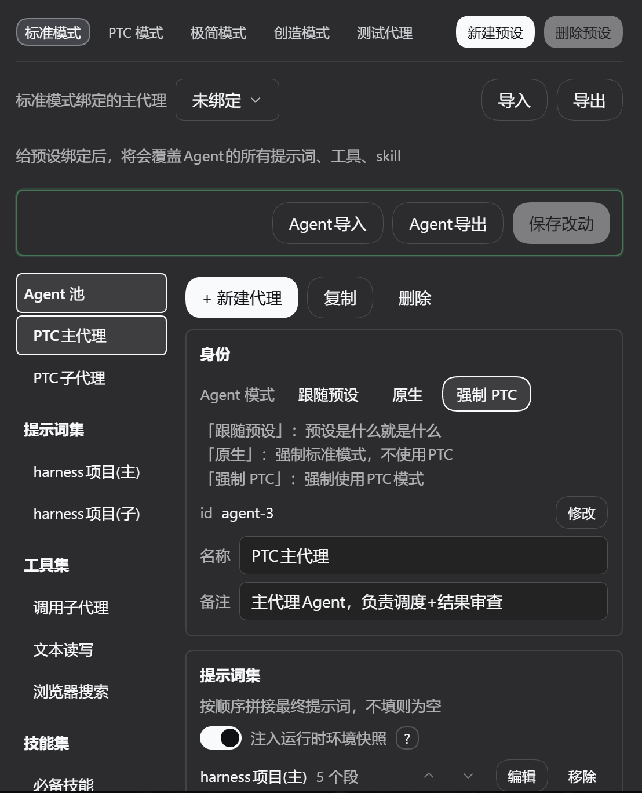
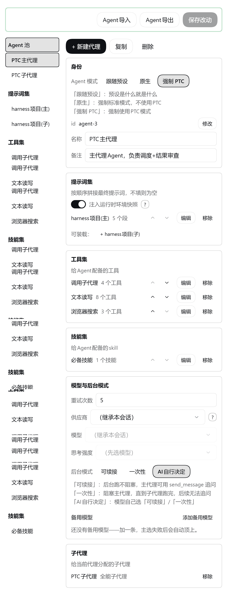
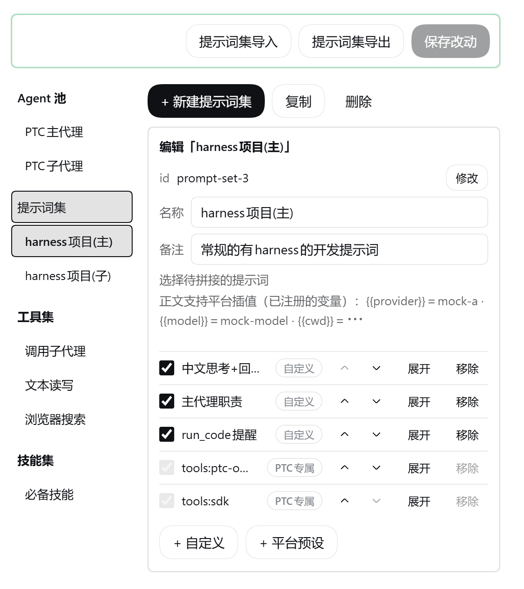
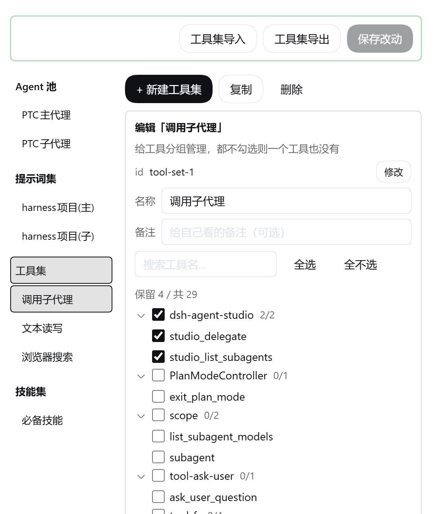
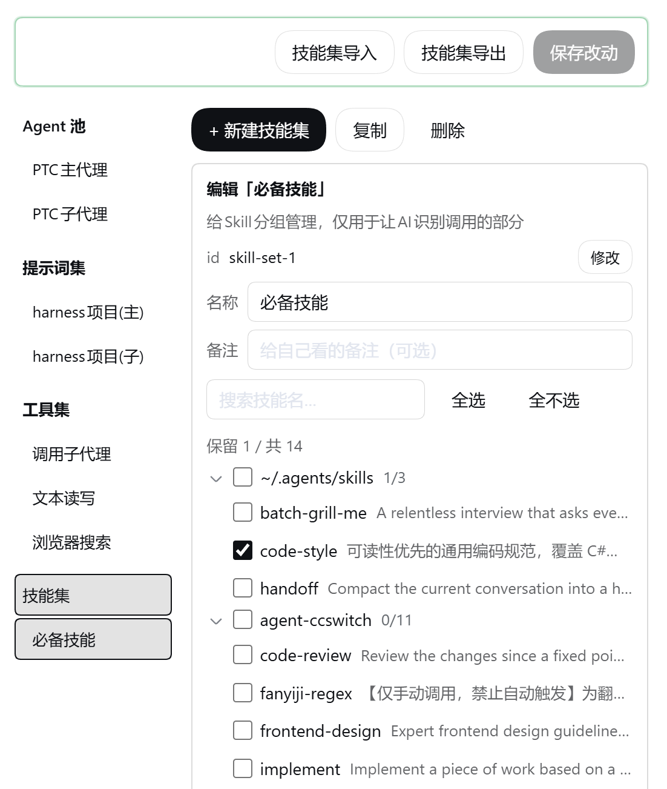

# dsh-agent-studio

[](https://thissensen.github.io/dsh-agent-studio/)
[](https://www.npmjs.com/package/dsh-agent-studio)
[](https://github.com/thissensen/dsh-agent-studio/actions/workflows/ci.yml)
[](./LICENSE)

[简体中文](README.md) · **English** · [Documentation](https://thissensen.github.io/dsh-agent-studio/)

A visual configuration plugin for [DeepSeek Harness](https://github.com/deepseek-ai/deepseek-harness): **configure an agent's prompt, tools, visible skills and subagents precisely, from a UI — assembling a team of them is just as easy.**

Every turn, the model sees three things: the **system prompt**, the **tool catalog**, and the **skill catalog**. The more plugins, tools and MCP servers you install, the bigger those three get, and the worse the model performs. On top of that, DSH's subagent configuration is bare-bones: there is no easy way to give a subagent its own prompt, tools, skills, model or reasoning effort.

This plugin fixes both. It turns an agent into bricks you can assemble freely: prompt, tools, skills, model. **Subagents get the same treatment**, presets can be created on the spot, and official PTC mode is supported.

It **never writes, deletes or edits any of the host's preset files**, and uninstalling restores everything.

It pairs well with [dsh-context](https://github.com/bowenliang123/dsh-context), which shows you what prompt, tools and skills a turn actually carried.

## What it solves

| The problem you hit | Platform default | With this plugin |
| --- | --- | --- |
| The system prompt grows and grows, and you can neither turn it off nor use it | Whatever sections the preset registers gets delivered | Write a whitelist per agent; anything not on it stays out |
| Too many tools, and the model can't pick well | The full tool surface of everything installed | Pick the ones this agent needs, put the rest away |
| Many skills, no good way to manage them | Every `modelInvocable` skill enters the catalog | Check the ones you want; the model can't see the rest |
| A runtime snapshot is pushed into every step | Injected by the platform, with no switch | A per-agent switch — turn it off and stop paying for it |
| Subagents can only inherit the parent wholesale, eating a lot of context | The official `subagent` has no entry identity and no per-role trimming | Configure each subagent on its own: model / prompt / tools / skills / background mode |
| Subagents created under PTC are PTC too | The platform inherits the parent's mode | You decide whether a subagent runs native or PTC |
| Different jobs want different prompts, tools and skills, and switching is a chore | A preset only swaps the prompt; tools and skills stay one global set | Switch the agent bound to that preset, and you're done |
| A local model is short on context and barely lasts a few turns | You cannot clear the prompt out entirely; you have to hand-build a preset | Create an agent with nothing loaded and bind it to the preset — a truly empty prompt |
| The primary model gets rate-limited or goes down, and the whole turn fails | Retries within one provider up to a limit, then gives up | Configure a chain of fallback models (possibly across providers); failures move down the chain (optional) |

## Install

Three routes — take the one that fits your setup: npm when you are online, the GitHub Release package for
offline or air-gapped setups, and source if you want to change the code.

### From npm

```sh
dsh plugin --profile web add dsh-agent-studio
```

### From a GitHub Release

Download `dsh-agent-studio-<version>.tgz` from [Releases](https://github.com/thissensen/dsh-agent-studio/releases). It is the very artifact npm serves, with the `lib/` and `client/` build output already inside — no build step:

```sh
dsh plugin --profile web add "./dsh-agent-studio-0.1.2.tgz"
```

The file can live in any directory as long as the path is right (`./` or an absolute path); swap in whatever version you actually downloaded. **Use this route for offline or air-gapped setups.**

### From source

```sh
git clone https://github.com/thissensen/dsh-agent-studio.git dsh-agent-studio
cd dsh-agent-studio

pnpm install                      # devDependencies only; the peers are host packages, not from the registry
node scripts/link-deps.mjs web    # link the host's @deepseek-ai/* into this project's node_modules
dsh plugin --profile web add "link:<absolute path to this directory>"
```

You can also unpack the source archive (`Source code (zip)`) from the Release page instead of cloning — the steps after that are identical.

All three routes end the same way: **restart DSH once** and look for the panel under **Settings → Agent Studio**.

- With a `link:` install, edits to `lib/` take effect immediately; **edits to the panel (`client/parts/panel.js`) just need a page refresh**.
- Changing entry fields in `package.json` (`main` / `exports` / `dsh.*`) does require a restart.
- `--profile` takes `web` (the pure web build) or `desktop`. The desktop app is the web build plus an Electron shell, so the host half needs no changes at all.

### Uninstall

```sh
dsh plugin --profile web remove dsh-agent-studio
```

Nothing is left behind in the host configuration. The presets were never touched, and everything else lives in the plugin's own data.

## Panel preview

Every screen ships in a light and a dark variant:

<p align="center">
  
  
</p>









| Area | What it does |
| --- | --- |
| Agent pool (left) | One row per agent: bound preset, loaded sets, Agent mode, subagent roster |
| Set libraries (left) | The three set pools: create, copy, rename, delete |
| Details (right) | Pick a set → edit its members; pick an agent → load sets, set the model and background mode, attach subagents, toggle the snapshot switch |
| Top bar | Preset tabs plus new / delete preset, main-agent binding, full import / export (the export is the draft, including unsaved changes) |
| Bottom bar | Save changes; per-pool import / export |

Import always opens a confirmation dialog first (whole-config and per-pool imports **share one**); its **"Overwrite same ids"** switch decides whether a colliding id is overwritten or fails the whole import. Import only merges into the draft — nothing is written until you save.

Before an id is renamed, the panel lists everyone referencing it, and the rename updates every reference — no dangling references are left behind.

## Four pools, independent of each other

Four kinds of configuration objects, each minding its own business, referencing each other many-to-many. A set you build once can be loaded into any number of agents.

| Pool | What it is for |
| --- | --- |
| **Agents** | Which preset it binds to; Agent mode (follow preset / native / force PTC), prompt, tools, skills, subagent roster — plus the model and reasoning effort to use when it acts as a subagent |
| **Prompt sets** `promptSets` | An ordered list of prompts; you set the order |
| **Tool sets** `toolSets` | Tool names — both plugin tools and MCP tools |
| **Skill sets** `skillSets` | A skill list deciding which ones the model may invoke on its own |

- **Loading** attaches a set to an agent. Two sets loaded by the same agent must not overlap — the panel and the write endpoint each block that.
- **Binding** attaches a preset to an agent, and that preset is then managed by it.

## Semantics

A binding takes over. The same rule on all three surfaces: **loading nothing means nothing**.

| Concept | Rule |
| --- | --- |
| Preset binding | The bound preset's prompt, tools, skills and subagents all go to this agent; unbind and everything is back to normal |
| Prompt sets | Loading none at all = an empty prompt is delivered |
| Tool sets | Loading none at all = no tools at all |
| Skill sets | Loading none at all = no skills exposed; load one and only the checked ones are |

## Automatic model fallback (optional)

Configure a chain of **fallback models** for an agent, and a failure of the primary is followed down the chain. **No fallbacks configured = no takeover at all** — retries then behave exactly as the platform default.

- **Retries**: an upper bound **per candidate**, default 5 (aligned with the platform default). Retryable errors (empty response / rate limit / server error / timeout / transport) are retried on the current candidate up to that bound before moving on; quota exhaustion, bad credentials and the like move on immediately.
- **How the chain is ordered**: subagents = the route given at start (inherited when the agent has no model) to fallbacks; main agents = the model chosen in the chat window to the main-model config to fallbacks. Your choice is **never overridden**; when everything is fine the plugin does not touch it.
- **What failure looks like**: the whole chain exhausted = that request fails for good (same as the platform). After a switch the session **does not switch back on its own**; change the model in the chat window and the plugin steps aside.
- **Visible**: retries and switches are written into the session (the panel's "retrying model request (N/M)" line comes from it), and a switch also leaves the model a notice that earlier turns were produced by the previous model.

## Quick start

1. **Open the panel**: Settings → Agent Studio. The agent pool and the three set libraries (prompt / tool / skill) are on the left, details on the right.
2. **Create a prompt set** and add sections. There are two kinds:
   - **Platform preset**: references a section the platform registers itself; its body follows platform upgrades and is read-only here;
   - **Custom**: your own body, supporting the platform's registered `{{variable}}` interpolation. Writing a variable the platform has not registered fails that request outright.
3. **Create a tool set** and check the tools you want to keep. `skill` is required — without it the model cannot invoke skills on its own.
4. **Create a skill set** and check the skills to expose. Candidates are grouped by source, collapsible, and whole groups can be checked at once — opening the panel queries the official skill service right away, no message needed first.
5. **Create an agent**: name it and write its note (when it acts as a subagent, the model picks by that note), load the sets above, pick its Agent mode (follow preset / native / force PTC) and background mode (resumable / one-shot / AI decides). The subagent roster lives here too. Configure a chain of **fallback models** too if you want (see the section above; optional).
6. **Bind** that agent to a platform preset.
7. **Save.** Nothing is written until you press save — **don't forget it**.

Once saved, open a new conversation with that preset and it is in effect.

## Configuration and data

Configuration lives in the plugin's own settings namespace `agent-studio` (in the user's `settings.yaml`). The model is four keys plus one binding:

```yaml
agent-studio:
  agents:        # agent pool
    - id: reviewer
      name: Code review
      note: Read-only review and advice   # when used as a subagent, the model picks by this
      model: { provider: deepseek, model: deepseek-v4.1-flash, reasoningEffort: medium }
      maxRetries: 5                   # per-candidate retry bound for automatic fallback (default 5)
      fallbacks:                      # the fallback chain (possibly across providers); empty = no takeover
        - { provider: senseaudio, model: glm-5.3-flash }
      background: foreground          # always-background | foreground | model-decides
      toolPresentation: follow        # follow | native | ptc
      promptSets: [review-sections]   # ordered: the order here is the delivery order of sections
      toolSets: [read-only]
      skillSets: [review-skills]
      children: [tester]              # the subagents it may delegate to
  promptSets:    # prompt sets: ordered sections; with text = custom, without = references a platform preset
  toolSets:      # tool sets: tool names
  skillSets:     # skill sets: skill names
  runtimeContextOff: [reviewer]       # these agents stop receiving the official runtime snapshot
  bindings:
    presets: [{ presetId: standard, agentId: reviewer }]   # preset → main agent
```

**All of these lists are arrays, not dictionaries.** The settings service merges objects recursively but replaces arrays wholesale, so with dictionaries the panel could never delete a member. The price is that id uniqueness is on us: the panel and the write endpoint both enforce it.

## Compatibility

- **Target environment**: the pure web build of DSH (`dsh --profile web`); community desktop builds work too.
- **Host services it depends on** (`peerDependencies`, all optional): `dsh-agent-presets` / `dsh-scope` / `dsh-settings` / `dsh-system-prompt` / `dsh-tools` / `schemastery`. When a DSH upgrade leaves one of them missing, the plugin degrades item by item instead of throwing.
- **Interface language and theme** follow the platform; Chinese and English copy ship with it, and both dark and light themes are supported.
- **The client half has no build step**: `client/index.js` is the shell (loaded at startup) and `client/parts/panel.js` is the panel (served on demand by a host route).

### Known limits

- **Sections cannot be rewritten under minimal-style presets.** Their persona section carries `complete: true`, meaning "this is the whole prompt, stop splicing". After the assembly waterfall returns, the platform forces the section list back to that one section, so whatever whitelist the plugin computed inside the waterfall is overwritten — that single section is always what ships. That is platform design, not a plugin defect, and since only one section was ever in play the practical loss is small. The tool and skill surfaces have no such post-processing, and `standard` / `code` / `cordis` and other regular presets behave normally.
- **Delegation uses the plugin's own tools**: `studio_list_subagents` computes the roster live, `studio_delegate` dispatches by agent id — **only through it do a subagent's own settings (prompt / tools / skills / model) resolve to its identity and take effect**. The official `subagent` tool gets no special treatment (it is there if your tool sets keep it), but the subagents it starts are never registered, so they only ever run with the surface of the main agent bound to that preset.
- **When several one-shot subagents are dispatched at once, identity is paired in order.** The platform's `agent/created` event does not say which dispatch triggered the creation, so the plugin can only assume queue order: first created pairs with first called. That held in testing, but the platform never promised it. Resumable subagents are unaffected — they get a pre-generated `childId` before starting, so the pairing is exact.
- **Tool candidates have a cold start.** With no session around, those tool registrations do not exist in the host process and cannot be queried from anywhere. So observations are cached per preset, and the panel falls back to that cache.

## Layout

```
lib/                  host-half output (the package's real entry; tsc from src/host/)
  index.js            entry: observation layer + routes + apply layer + delegation tools
  config.js           the four-pool schema + load-overlap check (single source of truth for the data model)
  preset.js           the one way to ask "which preset is this agent on"
  observe.js          read-only observation layer at assembly time
  cache.js            on-disk cache of observations (the panel's cold-start candidates)
  apply.js            the apply layer (main-agent assembly + subagent creation window)
  delegate.js         delegation tools + claim map and pending queue
  fallback.js         automatic model fallback (candidate chain / per-candidate retries / switch notice)
  presets.js          preset management (list / copy / delete, via official services)
  models.js           model catalog (provider / model / reasoning effort)
  attribution.js      tool source attribution (who registered it, best-effort)
  sdk-strip.js        PTC tools:sdk declaration trimming
  api.js              host-side route dispatch
  http-guard.js       HTTP request fence and response helpers
  types.js            shared types (types only, no runtime code)
client/               client-half output
  index.js            shell: module registration + runtime panel loading + failure fallback card
  parts/panel.js      the panel (served by the host at runtime; refresh the page after editing it)
src/host/  src/client/   source of truth (tsc → lib/, vite → client/)
types/                host type declarations
assets/               screenshots used by the READMEs
scripts/              dependency linking for source installs and consistency checks used by CI
```

## Documentation

Online documentation: **<https://thissensen.github.io/dsh-agent-studio/>** (the source lives in `docs/`, a VitePress site).

For the platform itself, the authoritative references remain the
[DeepSeek Harness repository](https://github.com/deepseek-ai/deepseek-harness) and its documentation site.

## License

[MIT](LICENSE)
